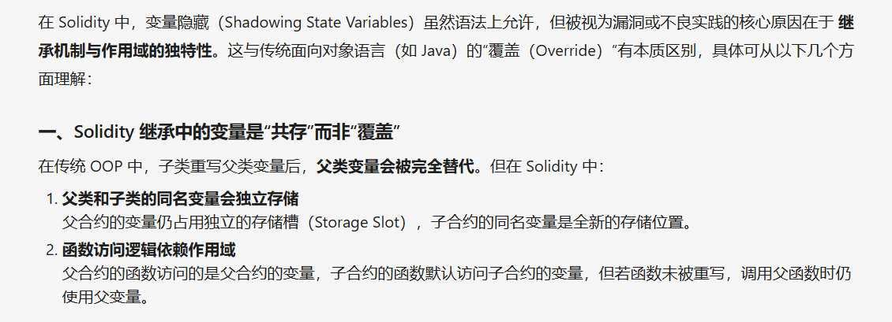

## 意外的变量隐藏（Shadowing State Variables）

 在solidity中使用两次相同的变量是可能的，但有可能造成副作用，这在处理多个合约时尤其困难。请看下面的示例：

```solidity
contract SuperContract {
  uint a = 1;
}
 
contract SubContract is SuperContract {
  uint a = 2;
}
```

 从上面示例可以看出SubContract继承自SuperContract，变量a被定义了两次[不同的](https://so.csdn.net/so/search?q=不同的&spm=1001.2101.3001.7020)值。现在假设我们使用'a'来执行SubContract中的函数，从SuperContract中继承的功能将不再工作，因为'a'的值已被修改。为了避免这个漏洞，重要的是我们要检查整个[智能合约](https://so.csdn.net/so/search?q=智能合约&spm=1001.2101.3001.7020)系统的歧义性。检查编译器警告也很重要，因为只要它们在智能合约中，它们就可以标记这些歧义。


---

注意！！！为什么这里说存在漏洞？！！！一定不能与传统OOP编程相提并论！！！

