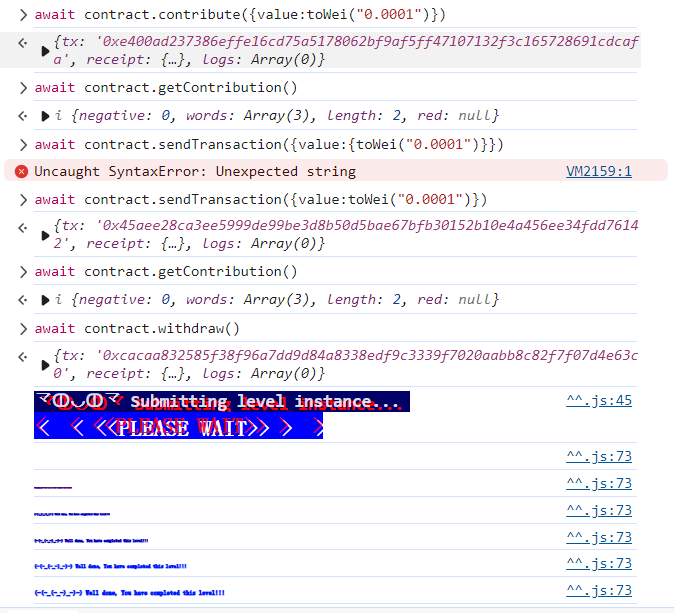

solidity合约：

```solidity
// SPDX-License-Identifier: MIT
pragma solidity ^0.8.0;

contract Fallback {
    mapping(address => uint256) public contributions;
    address public owner;

    constructor() {
        owner = msg.sender;
        contributions[msg.sender] = 1000 * (1 ether);
    }

    modifier onlyOwner() {
        require(msg.sender == owner, "caller is not the owner");
        _;
    }

    function contribute() public payable {
        require(msg.value < 0.001 ether);
        contributions[msg.sender] += msg.value;
        if (contributions[msg.sender] > contributions[owner]) {
            owner = msg.sender;
        }
    }

    function getContribution() public view returns (uint256) {
        return contributions[msg.sender];
    }

    function withdraw() public onlyOwner {
        payable(owner).transfer(address(this).balance);
    }

    receive() external payable {
        require(msg.value > 0 && contributions[msg.sender] > 0);
        owner = msg.sender;
    }
}
```


给的hint：

```txt
Look carefully at the contract's code below.

You will beat this level if

you claim ownership of the contract
you reduce its balance to 0
  Things that might help

How to send ether when interacting with an ABI
How to send ether outside of the ABI
Converting to and from wei/ether units (see help() command)
Fallback methods
```


学到东西了。

这个合约我们想要拿回owner的权限，利用的是 receive() external payable这个回调函数。

然后还需要学会如何传 `msg.value`。

方法：

```
await contract.xxxmethod({value:toWei("xxx")})
```

用JSON形式传。然后要注意，传的参数都用`"`括起来。


这个fallback回调函数只要检测到

```
msg.value > 0 && contributions[msg.sender] > 0
```

就会把owner设置为msg.sender。


所以，我们：

1. contribute 发 0.0001 eth，触发 contributions[msg.sender] += msg.value;
2. 调用default contract.sendTransaction ，触发fallback receive
3. withdraw取空
4. submit instance




```
You know the basics of how ether goes in and out of contracts, including the usage of the fallback method.

You've also learnt about OpenZeppelin's Ownable contract, and how it can be used to restrict the usage of some methods to a privileged address.

Move on to the next level when you're ready!
```

