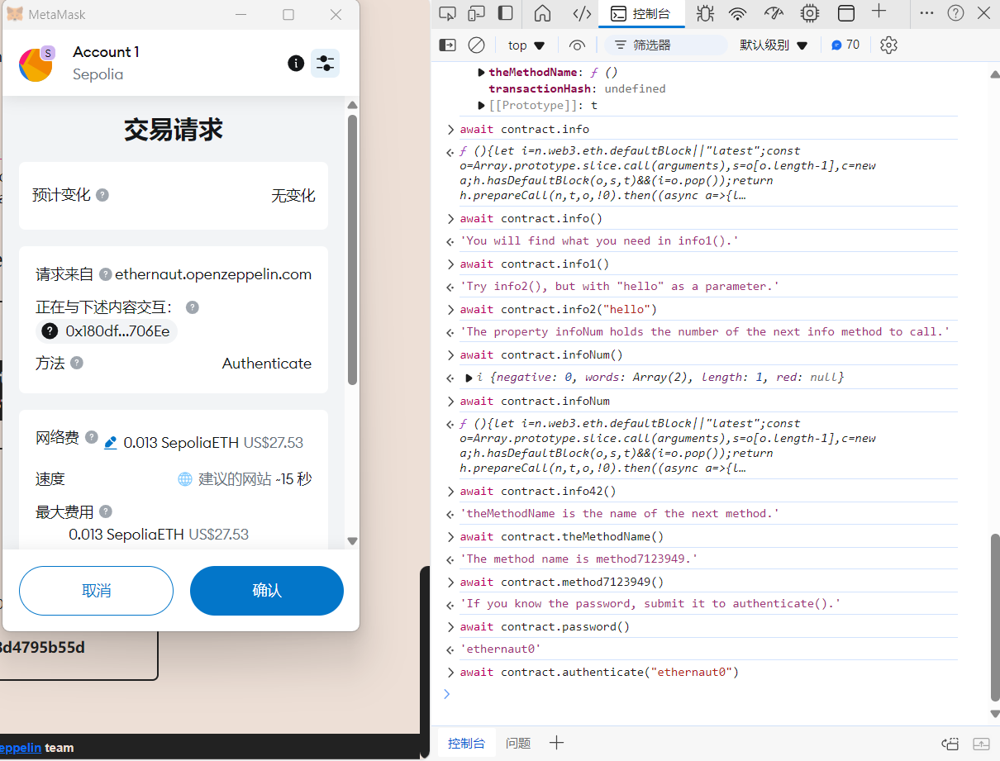
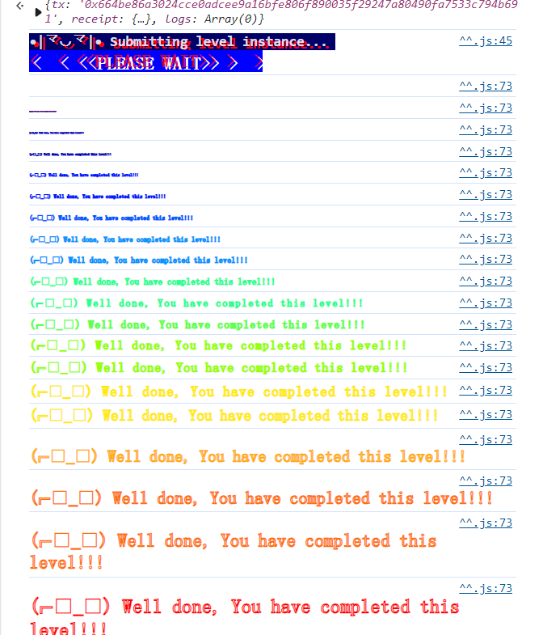

metamask连接，然后new Instance。


给了提示了，从

```
await contract.info()
```

开始。每一步都有引导。

就是一个最最最基本的前端js交互的练习。





确认后 ，submit instance:




Well done~


通关后给出了solidity合约代码：

```solidity
// SPDX-License-Identifier: MIT
pragma solidity ^0.8.0;

contract Instance {
    string public password;
    uint8 public infoNum = 42;
    string public theMethodName = "The method name is method7123949.";
    bool private cleared = false;

    // constructor
    constructor(string memory _password) {
        password = _password;
    }

    function info() public pure returns (string memory) {
        return "You will find what you need in info1().";
    }

    function info1() public pure returns (string memory) {
        return 'Try info2(), but with "hello" as a parameter.';
    }

    function info2(string memory param) public pure returns (string memory) {
        if (keccak256(abi.encodePacked(param)) == keccak256(abi.encodePacked("hello"))) {
            return "The property infoNum holds the number of the next info method to call.";
        }
        return "Wrong parameter.";
    }

    function info42() public pure returns (string memory) {
        return "theMethodName is the name of the next method.";
    }

    function method7123949() public pure returns (string memory) {
        return "If you know the password, submit it to authenticate().";
    }

    function authenticate(string memory passkey) public {
        if (keccak256(abi.encodePacked(passkey)) == keccak256(abi.encodePacked(password))) {
            cleared = true;
        }
    }

    function getCleared() public view returns (bool) {
        return cleared;
    }
}
```


可以看到就是学习一个简单的js交互调用。