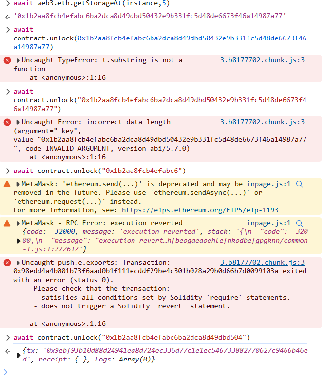

> The creator of this contract was careful enough to protect the sensitive areas of its storage.
>
> Unlock this contract to beat the level.
>
> Things that might help:
>
> - Understanding how storage works
> - Understanding how parameter parsing works
> - Understanding how casting works
>
> Tips:
>
> - Remember that metamask is just a commodity. Use another tool if it is presenting problems. Advanced gameplay could involve using remix, or your own web3 provider.


```solidity
// SPDX-License-Identifier: MIT
pragma solidity ^0.8.0;

contract Privacy {
    bool public locked = true;
    uint256 public ID = block.timestamp;
    uint8 private flattening = 10;
    uint8 private denomination = 255;
    uint16 private awkwardness = uint16(block.timestamp);
    bytes32[3] private data;

    constructor(bytes32[3] memory _data) {
        data = _data;
    }

    function unlock(bytes16 _key) public {
        require(_key == bytes16(data[2]));
        locked = false;
    }

    /*
    A bunch of super advanced solidity algorithms...

      ,*'^`*.,*'^`*.,*'^`*.,*'^`*.,*'^`*.,*'^`
      .,*'^`*.,*'^`*.,*'^`*.,*'^`*.,*'^`*.,*'^`*.,
      *.,*'^`*.,*'^`*.,*'^`*.,*'^`*.,*'^`*.,*'^`*.,*'^         ,---/V\
      `*.,*'^`*.,*'^`*.,*'^`*.,*'^`*.,*'^`*.,*'^`*.,*'^`*.    ~|__(o.o)
      ^`*.,*'^`*.,*'^`*.,*'^`*.,*'^`*.,*'^`*.,*'^`*.,*'^`*.,*'  UU  UU
    */
}
```


还是可以用 web3.eth.getStorageAt进行读取，只是要计算slot位置。

> 以太坊在儲存時是以32 bytes為一格順序儲存的，所以**定義變量的順序會影響花費Gas的多少**，這是一大特色。


Slot0：

bool public locked = true;

Slot1：

uint256 public ID = block.timestamp;

Slot2：

uint8 private flattening = 10;
uint8 private denomination = 255;
uint16 private awkwardness = uint16(block.timestamp);

Slot 3 ~ 5：

bytes32[3] private data;


data[2]刚好位于slot5，

所以：

```
await web3.eth.getStorageAt(instance,5)
```

然后把前16字节（32位）作为key 来 unlock




> Nothing in the ethereum blockchain is private. The keyword private is merely an artificial construct of the Solidity language. Web3's `getStorageAt(...)` can be used to read anything from storage. It can be tricky to read what you want though, since several optimization rules and techniques are used to compact the storage as much as possible.
>
> It can't get much more complicated than what was exposed in this level. For more, check out this excellent article by "Darius": [How to read Ethereum contract storage](https://medium.com/aigang-network/how-to-read-ethereum-contract-storage-44252c8af925)