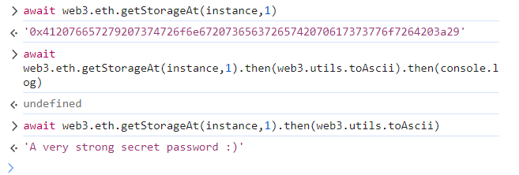

```
Unlock the vault to pass the level!
```


```solidity
// SPDX-License-Identifier: MIT
pragma solidity ^0.8.0;

contract Vault {
    bool public locked;
    bytes32 private password;

    constructor(bytes32 _password) {
        locked = true;
        password = _password;
    }

    function unlock(bytes32 _password) public {
        if (password == _password) {
            locked = false;
        }
    }
}
```


好吧，乍一看感觉没办法弄，但是，区块链，都是在链上公开的！。。。哪怕password是private，但一样可以得到。。。

使用[Web3的getStorageAt函數](https://web3js.readthedocs.io/en/v1.3.1/web3-eth.html#getstorageat)可以取得指定地址特定位置的[storage](https://docs.soliditylang.org/en/v0.8.1/introduction-to-smart-contracts.html#storage-memory-and-the-stack)


所以我们可以尝试进行读取：

```js
await web3.eth.getStorageAt(instance, 1).then(web3.utils.toAscii).then(console.log);
```



然后unlock即可。

```js
await contract.unlock(web3.utils.fromAscii("A very strong secret password :)"));
```


It's important to remember that marking a variable as private only prevents other contracts from accessing it. State variables marked as private and local variables are still publicly accessible.

To ensure that data is private, it needs to be encrypted before being put onto the blockchain. In this scenario, the decryption key should never be sent on-chain, as it will then be visible to anyone who looks for it. [zk-SNARKs](https://blog.ethereum.org/2016/12/05/zksnarks-in-a-nutshell/) provide a way to determine whether someone possesses a secret parameter, without ever having to reveal the parameter.

