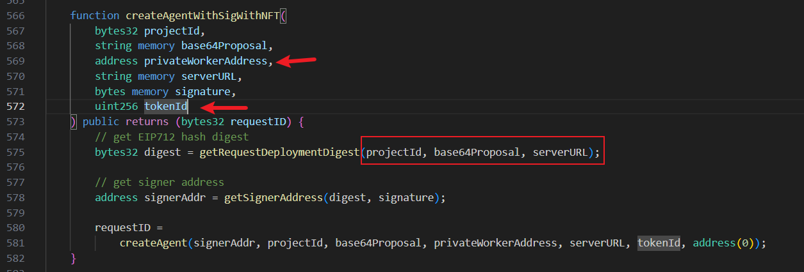
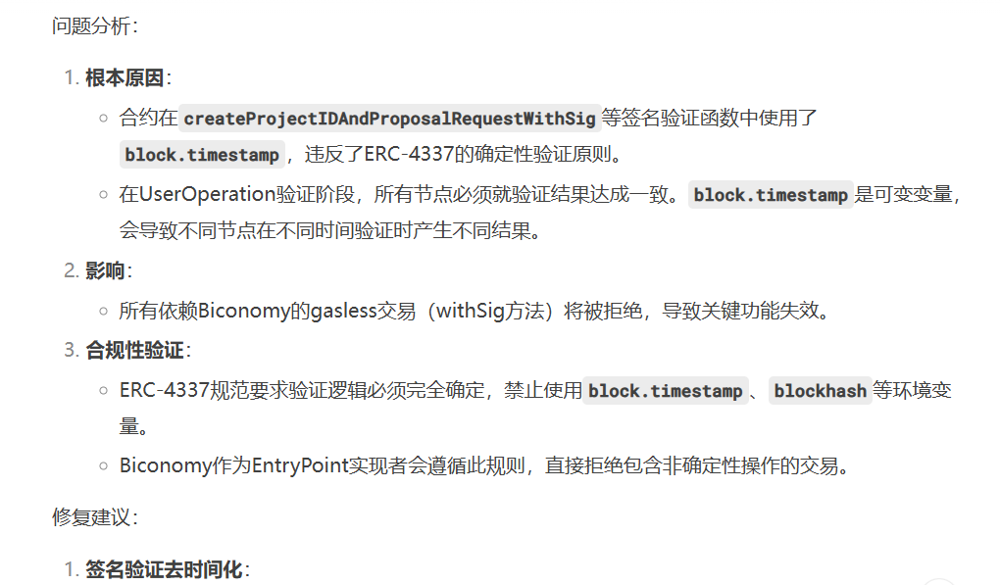

```
https://audits.sherlock.xyz/contests/755
```


跟着学习，自己看硬是没看出什么东西。


# Signatures missing some parameters being vulnerable to attackers using them coupled with malicious parameters - High

### Summary

[`createAgentWithSigWithNFT()`](https://github.com/sherlock-audit/2025-03-crestal-network/blob/main/crestal-omni-contracts/src/BlueprintCore.sol#L566) for example signs `projectId, base64RecParam, serverURL`. However, it does not sign `privateWorkerAddress` or tokenId. This is an issue because although Base has a private mempool, the protocol integrates with Biconomy, which leverages ERC4337 and has a mempool for bundlers. Hence, the signatures will be available in the mempool and anyone can fetch them and submit it directly to base with other malicious `tokenId` or `privateWorkerAddress`.

Thus, users can be forced to create agents with token ids they didn't intend to use or use invalid worker addresses, DoSing them. Workers have incentive to do this as they can censor other workers this way from using other workers and only they will be able to make the deployments, censoring other workers. The protocol intends to benefit workers from their work, so they have incentive to do so.

If `[createAgentWithTokenWithSig()](https://github.com/sherlock-audit/2025-03-crestal-network/blob/main/crestal-omni-contracts/src/BlueprintCore.sol#L491)`, the token address used can be another one that has a bigger cost and users end up paying more.

### Root Cause

In `createAgentWithSigWithNFT()` and similar, `tokenAddress`, `tokenId`, `privateWorkerAddress` are not signed.

### Internal Pre-conditions

None.

### External Pre-conditions

None.

### Attack Path

1. User sends signature to be used on `createAgentWithSigWithNFT()` or `createAgentWithTokenWithSig()` to the offchain protocol, which forwards it to Biconomy, adding the user operation to the mempool.
2. Attacker picks up the signature from the eip4337 mempool and submits the onchain transaction with other malicious inputs.

### Impact

Worker censors other workers, DoSes users, makes them pay fees without getting services and ultimately forces users to use the attacker worker's services, who gets illegitimate fees.
Or, attacker steals tokens from users by specifying a different token address.
Or, another token id ownership is used.

### PoC

[Here](https://docs.biconomy.io/smartAccountsV2/bundler#bundler) is how the biconomy bundler works (which is the same as the typical bundler):

> Aggregating userOps in an alternative mempool to normal Ethereum Transactions

Attacker can become a bundler and listen to the same mempool and perform the attack.

### Mitigation

Sign all parameters.

---

这个点确实没意识到




但还是要结合Biconomy的一些规范来说


# `block.timestamp` is forbidden by Biconomy and will DoS all `withSig` flows - Medium

### Summary

The protocol uses `block.timestamp` when calling createProjectIDAndProposalRequestWithSig, createProjectIDAndDeploymentRequestWithSig, createAgentWithTokenWithSig, createAgentWithWhitelistUsersWithSig, createAgentWithSigWithNFT, updateWorkerDeploymentConfigWithSig. This is forbidden by Biconomy and all transactions will be rejected.

[Example](https://github.com/sherlock-audit/2025-03-crestal-network/blob/main/crestal-omni-contracts/src/BlueprintCore.sol#L216)

### Root Cause

In the functions mentioned in the summary, `block.timestamp` is used. Go through the functions to verify that they all lead to calculating an identifier or project id or similar which uses `block.timestamp`.

### Internal Pre-conditions

None.

### External Pre-conditions

None.

### Attack Path

1. User tries to submit gasless transaction in any of the mentioned functions in the summary to Biconomy but fails.

### Impact

DoSed gasless transactions, which is key functionality.

### PoC

Biconomy as an [article](https://www.biconomy.io/post/bundler-integration-testing-end-to-end-userop-lifecycle) explaining this, if users try to submit transactions to them that triggers code using `block.timestamp`, they will reject it. This is also part of ERC4337 validation [rules](https://eips.ethereum.org/EIPS/eip-7562#opcode-rules), so it will never work.

### Mitigation

Do not use forbideen opcodes.


这个主要就是要知道一个点：

> Is the codebase expected to comply with any specific EIPs?
>
> There is a gasless feature for many functions, that are meant to use EIP712 signatures to stay compliant with Biconomy's MEE-forwarded contract calls.

然后要明确 Biconomy的规范。

看这篇存档：

```
https://web.archive.org/web/20231211053758/https://www.biconomy.io/post/bundler-integration-testing-end-to-end-userop-lifecycle
```

虽说还是没看出哪儿有问题，问了问DS：




当一个点记住吧。

以后审计时先看README说明要遵循哪些规范。


# Missing Access Control allows malicious resetting of project - Medium

### Summary

The protocol does not implement any Access Control on the sensitive `upgradeProject()` function

### Root Cause

[upgradeProject()](https://github.com/sherlock-audit/2025-03-crestal-network/blob/main/crestal-omni-contracts/src/BlueprintCore.sol#L198-L203) resets critical project data, including proposal and deployment requests.
Without access control, any malicius user can erase project data, leading to DOSs or interference with legitimate operations. Restricting it to the project owner prevents unauthorized resets and ensures only authorized modifications.

```
    function upgradeProject(bytes32 projectId) public hasProject(projectId) {  
          
        // reset project info  
        projects[projectId].requestProposalID = 0;  
        projects[projectId].requestDeploymentID = 0;  
        projects[projectId].proposedSolverAddr = dummyAddress;  
    }  
```

### Internal Pre-conditions

1. Valid projectId

### External Pre-conditions

None

### Attack Path

```
1.	createProjectIDAndDeploymentRequest() → for public deployments.  
2.	The project is now active, waiting for execution.  
3.	Malicious user calls upgradeProject(projectId), which resets:  
        • requestProposalID = 0  
        • requestDeploymentID = 0  
        • proposedSolverAddr = dummyAddress  
4.	This erases the pending deployment and forces the user to restart the process.  
5.	The legitimate user tries to proceed, but the deployment request no longer exists.  
6.	If the malicious user repeatedly calls upgradeProject(), the user is unable to complete deployment.  
7.	This results in continuous disruption, effectively blocking progress and making the project unusable.  
```

### Impact

Temporary DOS

Attackers can repeatedly call upgradeProject(), preventing a valid proposal from ever reaching the deployment stage.

### Mitigation

Add Access control to `upgradeProject()`


---

oh。。。我审计的时候看到这个了的，但因为有个 hasProject的modifier，以为没有问题，结果可以加 Internal Pre-conditions 。。。

还有一个点，这里有很多很多重复的提交，所以要把 Attack Path 学着这样写详细 + 早提交 才能pass。


# If NFT contract is changed, some user may not be able to create an agent - Medium

### Summary

The Crestal Network allows users to create an AI agent by paying ERC20 tokens, or via Nation Pass NFT. For NFT payments, `Blueprint` contract will not transfer NFT from user, instead, it records the token ID used for payment, to prevent the same NFT ID being used twice. However, if the NFT contract gets changed some time, it will cause some users fail to create an agent despite their NFT has never been used.

### Root Cause

In [`createAgent`](https://github.com/sherlock-audit/2025-03-crestal-network/blob/main/crestal-omni-contracts/src/BlueprintCore.sol#L427) internal function, we see, if the `tokenAddress` is zero address, meaning user is paying with NFT:

```
        if (tokenAddress == address(0)) {  
            // create agent with nft  
            // check NFT token id is already used or not  
            require(nftTokenIdMap[tokenId] != Status.Pickup, "NFT token id already used"); // <=(1)  
  
            // check NFT ownership  
            require(checkNFTOwnership(nftContractAddress, tokenId, userAddress), "NFT token not owned by user");  
  
            requestID = createCommonProjectIDAndDeploymentRequest(  
                userAddress, projectId, base64Proposal, privateWorkerAddress, serverURL  
            );  
  
            // update NFT token id status  
            nftTokenIdMap[tokenId] = Status.Pickup; // <=(2)  
  
            // set deployment owner  
            deploymentOwners[requestID] = userAddress;  
  
            // emit create agent event  
            emit CreateAgent(projectId, requestID, userAddress, tokenId, 0);  
        }   
```

In (1), we see there is a require statement to revert if the tokenId is used before and has status of `Pickup`. The only possible way for any NFT to get such status is after payment, as we can see in (2).

Also in `Blueprint` contract, there is a function to update NFT contract:

```
    function setNFTContractAddress(address _nftContractAddress) public onlyOwner {  
        require(_nftContractAddress != address(0), "NFT Contract is invalid");  
        nftContractAddress = _nftContractAddress;  
    }  
```

Which means it's possible that the NFT contract will be changed some day. However, different NFT may have same token ID, but since the way `createAgent` works is only track tokenId, but not NFT address as well, it will make some users unable to create agent despite their NFT is never used for payment.

### Internal Pre-conditions

1. Alice creates an agent with NFT at 0x1234 and token ID 4.

### External Pre-conditions

1. The protocol decides to change to a new NFT contract at 0x2345 for payment, for any reasons.
2. Bob, who owns token ID 4 at NFT 0x2345, wants to create agent, but will fail due to the token ID check.

### Attack Path

N/A

### Impact

Some user may not be able to create agent, despite their NFT has never been used as payment.

### PoC

*No response*

### Mitigation

Track NFT payment also with NFT address, or some other identifiers.

---

oh my. 这个确实，这是怎么想到的啊？！佩服。

应该用 nftTokenIdMap[NFTaddress] [tokenId]来做mapping


# Attacker can DoS all functions that use a `createProjectID` type of function - Medium

### Summary

`createAgent()` can be completely DoSed as it reverts if the `projectId` already exists, starting [here](https://github.com/sherlock-audit/2025-03-crestal-network/blob/main/crestal-omni-contracts/src/BlueprintCore.sol#L444-L446). Users can create any `projectId` by calling the other functions, such as `createProjectIDAndPrivateDeploymentRequest()`, without paying any fees.
`projectId` is given by:
`projectId = keccak256(abi.encodePacked(block.timestamp, msg.sender, block.chainid));`
Thus, it is very easy to predict future project ids for certain addresses and DoS them without even frontrunning.

### Root Cause

`projectId` should always be computed, not sent as argument, as it can be manipualted.

### Internal Pre-conditions

None

### External Pre-conditions

None

### Attack Path

1. Attacker calls `createProjectIDAndPrivateDeploymentRequest()` with `projectId`s of other users.

### Impact

DoSed agent creation

### PoC

*No response*

### Mitigation

Do not send projectId as argument.


---

当时想到了这个block.timestamp是predictable的，但是，没有转换到这个漏洞的点是在于其他地方

，比如：createProjectIDAndPrivateDeploymentRequest，传入的是projectId，这个点是可以由我们上面提到的block.timestamp predictable这个点来预测的！！！ 如果不传入projectId的话，这个漏洞就成立不了。


# EIP4337 does not allow accessing storage slots that do not belong to the sender of the user operation, leading to DoS signature flows - Medium

### Summary

Accessing storage slots that do not belong to the `sender` of the EIP4337 transaction (user operation) is forbidden, which means that any of the functions that are supposed to support gasless transactions (namely the ones that have `withSig` in the end) will not work and this key protocol functionality will be DoSed.

### Root Cause

The following examples show storage slots that are forbidden by EIP4337.
In [Payment:20](https://github.com/sherlock-audit/2025-03-crestal-network/blob/main/crestal-omni-contracts/src/Payment.sol#L20), `nftToken.ownerOf(nftId)`.
In [BlueprintCore:439](https://github.com/sherlock-audit/2025-03-crestal-network/blob/main/crestal-omni-contracts/src/BlueprintCore.sol#L439), `nftTokenIdMap[tokenId]`.
In [BlueprintCore:452](https://github.com/sherlock-audit/2025-03-crestal-network/blob/main/crestal-omni-contracts/src/BlueprintCore.sol#L452), `deploymentOwners[requestID]` it even writes to storage (and other instances also do), which is even more problematic.

### Internal Pre-conditions

None.

### External Pre-conditions

None.

### Attack Path

1. User gives signature offchain to initiate gasless transaction in any of the `withSig` functions.
2. Offchain backend tries to call biconomy api to submit the gasless transaction, but it gets rejected because in their validation step, it does not allow accessing storage slots that are not composed by the `sender` address.

### Impact

DoSed `withSig` functions, which are key functionality to allow gasless payments.

### PoC

Biconomy rules [here](https://docs.biconomy.io/smartAccountsV2/modules#validation-modules) state that:

> ERC-4337 [storage rules](https://github.com/eth-infinitism/account-abstraction/blob/abff2aca61a8f0934e533d0d352978055fddbd96/eip/EIPS/eip-4337.md#storage-associated-with-an-address) apply to this.

The [rules](https://github.com/eth-infinitism/account-abstraction/blob/abff2aca61a8f0934e533d0d352978055fddbd96/eip/EIPS/eip-4337.md#storage-associated-with-an-address) are:

> We define storage slots as "associated with an address" as all the slots that uniquely related on this address, and cannot be related with any other address. In solidity, this includes all storage of the contract itself, and any storage of other contracts that use this contract address as a mapping key.

> An address A is associated with:

> Slots of contract A address itself.
> Slot A on any other address.
> Slots of type keccak256(A || X) + n on any other address. (to cover mapping(address => value), which is usually used for balance in ERC-20 tokens). n is an offset value up to 128, to allow accessing fields in the format mapping(address => struct)

As can be seen, it's not allowed to access any storage, only storage mappings associated with the account/sender. Hence, all `withSig` transactions will fail.

### Mitigation

**Do not read/write to storage slots when using Biconomy.**

---

又是之前提到的，这个contract需要follow哪些规范！！！


# User can create agent without paying some tokens or nft - Medium

## Vulnerability details

The `BlueprintCore` contract facilitates users to create agent via `createAgentWithToken()`, `createAgentWithNFT()`, etc. where the user must store some tokens or nfts to pay their agent. But, this rule can be bypassed with a user calls `createProjectIDAndPrivateDeploymentRequest()` function directly to avoid storing tokens or nft to the protocol.

```
function createProjectIDAndPrivateDeploymentRequest(  
        bytes32 projectId,  
        string memory base64Proposal,  
        address privateWorkerAddress,  
        string memory serverURL  
    ) public returns (bytes32 requestID) {  
        requestID = createCommonProjectIDAndDeploymentRequest(  
            msg.sender, projectId, base64Proposal, privateWorkerAddress, serverURL  
        );  
    }  
```

Function above passes `privateWorkerAddress` as well. It causes the deployment status to be `Status.Pickup`.

```
 function deploymentRequest(  
        address userAddress,  
        bytes32 projectId,  
        address solverAddress,  
        address workerAddress,  
        string memory base64Proposal,  
        string memory serverURL,  
        uint256 index  
    ) internal hasProject(projectId) returns (bytes32 requestID, bytes32 projectDeploymentId) {  
    ...  
  
    // when workerAddress is not same with dummy, automatically the status changes become pickup  
    DeploymentStatus memory deploymentStatus = DeploymentStatus({  
            status: (workerAddress == dummyAddress ? Status.Issued : Status.Pickup),  
            deployWorkerAddr: workerAddress  
        });  
  
    requestDeploymentStatus[requestID] = deploymentStatus;  
    ...  
    }  
```

Since the deployment status becomes `pickup`, the users can call `submitProofOfDeployment()`.

```
function submitProofOfDeployment(bytes32 projectId, bytes32 requestID, string memory proofBase64)  
        public  
        hasProject(projectId)  
    {  
        // all requirement check had passed  
        require(requestID.length > 0, "requestID is empty");  
        require(requestDeploymentStatus[requestID].status != Status.Init, "requestID does not exist");  
        require(requestDeploymentStatus[requestID].deployWorkerAddr == msg.sender, "Wrong worker address");  
        require(requestDeploymentStatus[requestID].status != Status.GeneratedProof, "Already submitted proof");  
  
        // set deployment status into generatedProof  
        requestDeploymentStatus[requestID].status = Status.GeneratedProof;  
  
        // save deployment proof to mapping  
        deploymentProof[requestID] = proofBase64;  
  
        emit GeneratedProofOfDeployment(projectId, requestID, proofBase64);  
    }  
```

The scenario above will look like `createProjectIDAndPrivateDeploymentRequest() -> createCommonProjectIDAndDeploymentRequest() -> receive requestID -> submitProofOfDeployment()`.

The normal scenario is `createAgentWithToken() -> createAgent() -> store tokens or nfts -> createCommonProjectIDAndDeploymentRequest() -> receive requestID -> submitProofOfDeployment()`.

The difference is the scenario above create an agent without storing some tokens or nfts.

## Impact

Users can create agent without storing some tokens or nfts, causing loss to the protocol.

## Proof of concept

```
function test_userCouldBypassPegged() public {  
        string memory base64Proposal = "test base64 proposal";  
        string memory serverURL = "http://example.com";  
        string memory proofBase64 = "proofBase64";  
        bytes32 requestID;  
  
        vm.startPrank(user);  
  
        // 1. user calls createProjectIDAndPrivateDeploymentRequest  
        requestID = blueprint.createProjectIDAndPrivateDeploymentRequest(  
            projectId,  
            base64Proposal,  
            user,  
            serverURL  
        );  
  
        // 2. user calls submitProofOfDeployment  
        blueprint.submitProofOfDeployment(  
            projectId,  
            requestID,  
            proofBase64  
        );  
        vm.stopPrank();  
  
        string memory proofBase64Actual = blueprint.getDeploymentProof(requestID);  
  
        assertEq(keccak256(abi.encode(proofBase64)), keccak256(abi.encode(proofBase64Actual)));  
    }  
Ran 1 test for test/BlueprintV5.t.sol:BlueprintTest  
[PASS] test_userCouldBypassPegged() (gas: 238177)  
Suite result: ok. 1 passed; 0 failed; 0 skipped; finished in 51.06ms (49.46ms CPU time)  
```

https://github.com/sherlock-audit/2025-03-crestal-network/blob/main/crestal-omni-contracts/src/BlueprintCore.sol#L416-L425
