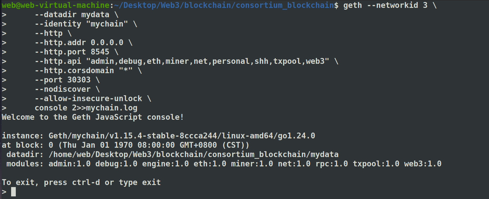
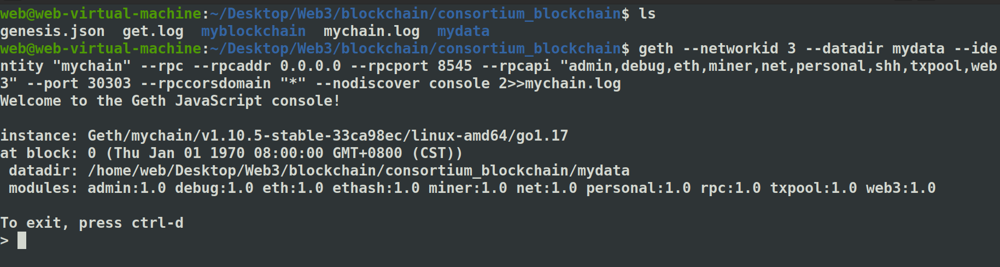
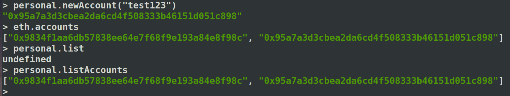
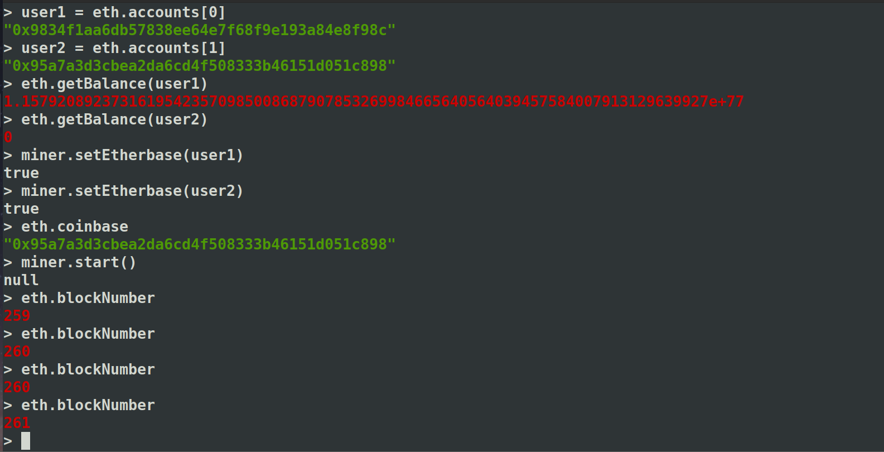
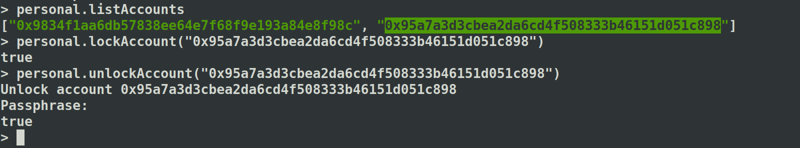

# 安装

参考这篇：

```
https://blog.csdn.net/qq_39869387/article/details/115432897
```

但安装 truffle的命令要改，node和npm版本：

```
nvm install 18
nvm use 18
```


安装truffle：

```
npm install -g truffle@5.4.21 --verbose
```


然后就是启动私有链的命令行，我的geth版本已经没有用rpc参数了，改为了http：

```
geth --networkid 3 \
     --datadir mydata \
     --identity "mychain" \
     --http \
     --http.addr 0.0.0.0 \
     --http.port 8545 \
     --http.api "admin,debug,eth,miner,net,personal,shh,txpool,web3" \
     --http.corsdomain "*" \
     --port 30303 \
     --nodiscover \
     --allow-insecure-unlock \
     console 2>>mychain.log
```




还是手动编译低版本的geth吧，不然不兼容。。。

```
https://blog.csdn.net/weixin_52865146/article/details/132799374
```

# 启动

```
geth --networkid 3 --datadir mydata --identity "mychain" --rpc --rpcaddr 0.0.0.0 --rpcport 8545 --rpcapi "admin,debug,eth,miner,net,personal,shh,txpool,web3" --port 30303 --rpccorsdomain "*" --nodiscover console 2>>mychain.log
```




# 基本测试

然后照着这篇测试一下：

```
https://www.cnblogs.com/xixi3/p/12496694.html
```


注意，dev那儿要：

```
geth --dev --datadir "./ethdev" --nodiscover --dev.period 1 console 2>>get.log
```





# miner

然后开始挖矿：




# transfer


转账成功，说明已经挖矿成功，有新的区块了。

挖矿过程的日志：get.log：

```
INFO [03-04|12:08:25.590] Commit new mining work                   number=1 sealhash=335842..855071 uncles=0 txs=0 gas=0 fees=0 elapsed="53.083µs"
INFO [03-04|12:08:25.591] Successfully sealed new block            number=1 sealhash=335842..855071 hash=be316a..4dd5da elapsed="898.209µs"
INFO [03-04|12:08:25.591] 🔨 mined potential block                  number=1 hash=be316a..4dd5da
INFO [03-04|12:08:25.591] Commit new mining work                   number=2 sealhash=8be17f..eee182 uncles=0 txs=0 gas=0 fees=0 elapsed="389.303µs"
INFO [03-04|12:08:26.001] Successfully sealed new block            number=2 sealhash=8be17f..eee182 hash=07229a..f0cb62 elapsed=409.150ms
INFO [03-04|12:08:26.001] 🔨 mined potential block                  number=2 hash=07229a..f0cb62
INFO [03-04|12:08:26.001] Commit new mining work                   number=3 sealhash=f99dad..a8719c uncles=0 txs=0 gas=0 fees=0 elapsed="416.968µs"
INFO [03-04|12:08:27.007] Successfully sealed new block            number=3 sealhash=f99dad..a8719c hash=5d533c..5d6f7a elapsed=1.006s
INFO [03-04|12:08:27.007] 🔨 mined potential block                  number=3 hash=5d533c..5d6f7a
INFO [03-04|12:08:27.008] Commit new mining work                   number=4 sealhash=78ffbf..135560 uncles=0 txs=0 gas=0 fees=0 elapsed="230.972µs"
INFO [03-04|12:08:28.005] Successfully sealed new block            number=4 sealhash=78ffbf..135560 hash=9c0ac5..34700a elapsed=997.154ms
INFO [03-04|12:08:28.005] 🔨 mined potential block                  number=4 hash=9c0ac5..34700a
INFO [03-04|12:08:28.005] Commit new mining work                   number=5 sealhash=7fd55e..11a8e3 uncles=0 txs=0 gas=0 fees=0 elapsed="280.089µs"
INFO [03-04|12:08:29.001] Successfully sealed new block            number=5 sealhash=7fd55e..11a8e3 hash=7859cc..6cce17 elapsed=995.674ms
INFO [03-04|12:08:29.001] 🔨 mined potential block                  number=5 hash=7859cc..6cce17
INFO [03-04|12:08:29.001] Commit new mining work                   number=6 sealhash=71d648..fa5a81 uncles=0 txs=0 gas=0 fees=0 elapsed="335.17µs"
INFO [03-04|12:08:30.000] Successfully sealed new block            number=6 sealhash=71d648..fa5a81 hash=03e3c3..e914f7 elapsed=998.949ms
INFO [03-04|12:08:30.003] 🔨 mined potential block                  number=6 hash=03e3c3..e914f7
INFO [03-04|12:08:30.001] Commit new mining work                   number=7 sealhash=71ba5f..94ec5c uncles=0 txs=0 gas=0 fees=0 elapsed="382.1µs"
INFO [03-04|12:08:31.004] Successfully sealed new block            number=7 sealhash=71ba5f..94ec5c hash=83c498..d26498 elapsed=1.003s
```


还有一个personal.unlockAccount


查看交易信息：

```js
> eth.getTransaction("0x02fba1f2cee5e46796a3a160d43c4604f786f8889f17ef08973dea7021ec92da")
{
  accessList: [],
  blockHash: "0xb7e7609ee7b2b35e393bef0c44f2e40b7c25216700d8a86217310a78e95499ee",
  blockNumber: 641,
  chainId: "0x539",
  from: "0x95a7a3d3cbea2da6cd4f508333b46151d051c898",
  gas: 21000,
  gasPrice: 8,
  hash: "0x02fba1f2cee5e46796a3a160d43c4604f786f8889f17ef08973dea7021ec92da",
  input: "0x",
  maxFeePerGas: 15,
  maxPriorityFeePerGas: 1,
  nonce: 0,
  r: "0xb7470cbf170194e21aeb3dfa127290fc6f1296bd48e9f753c4771ed125729f8a",
  s: "0x3afa905088f4577bca16cb6de0c576985f2f430f46db27eb388e76fa0debc81e",
  to: "0x9834f1aa6db57838ee64e7f68f9e193a84e8f98c",
  transactionIndex: 0,
  type: "0x2",
  v: "0x1",
  value: 1000000000000000
}
> eth.getTransactionReceipt("0x02fba1f2cee5e46796a3a160d43c4604f786f8889f17ef08973dea7021ec92da")
{
  blockHash: "0xb7e7609ee7b2b35e393bef0c44f2e40b7c25216700d8a86217310a78e95499ee",
  blockNumber: 641,
  contractAddress: null,
  cumulativeGasUsed: 21000,
  effectiveGasPrice: 8,
  from: "0x95a7a3d3cbea2da6cd4f508333b46151d051c898",
  gasUsed: 21000,
  logs: [],
  logsBloom: "0x00000000000000000000000000000000000000000000000000000000000000000000000000000000000000000000000000000000000000000000000000000000000000000000000000000000000000000000000000000000000000000000000000000000000000000000000000000000000000000000000000000000000000000000000000000000000000000000000000000000000000000000000000000000000000000000000000000000000000000000000000000000000000000000000000000000000000000000000000000000000000000000000000000000000000000000000000000000000000000000000000000000000000000000000000000000",
  status: "0x1",
  to: "0x9834f1aa6db57838ee64e7f68f9e193a84e8f98c",
  transactionHash: "0x02fba1f2cee5e46796a3a160d43c4604f786f8889f17ef08973dea7021ec92da",
  transactionIndex: 0,
  type: "0x2"
}
> 

```


